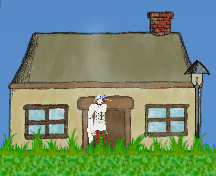

# Storkman

Storkman is a 2D metroidvania game. Main goal of the project is to learn new things.

## Features:
- Vector based graphics engine
- Key frames based animations system
- Open world (coming soon)

## Technologies:
- SFML 2.5.1

## Screenshots:

